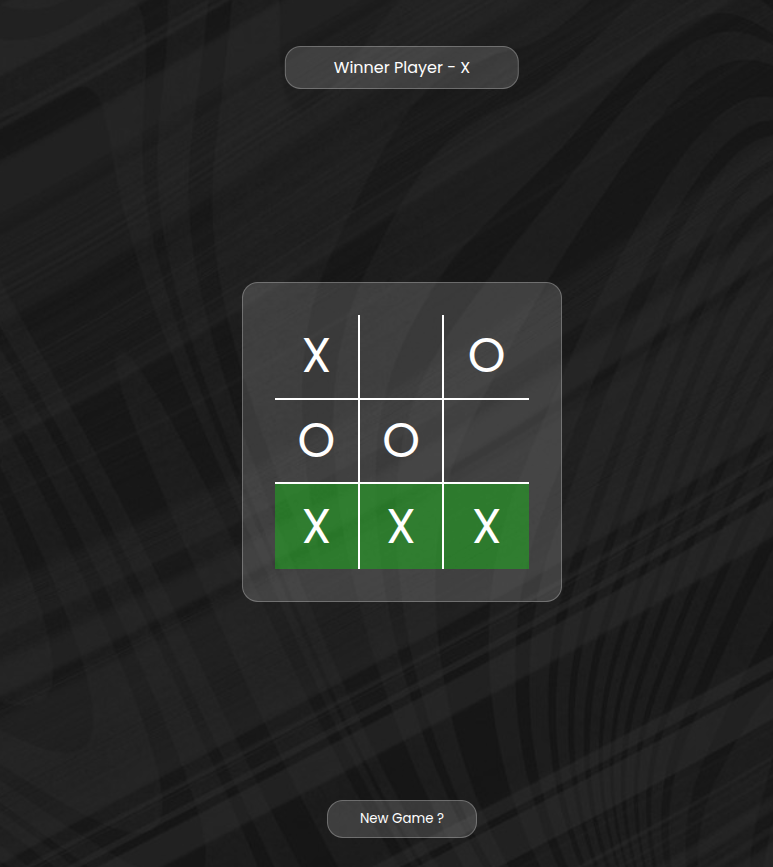

# 🎮 Tic Tac Toe 🎮

### A simple, visually stunning take on the classic Tic Tac Toe game!

# 🎯 How to Play

- ### 🎲 Player X goes first
- ### 🎮 Click on any empty cell to place your mark
- ### 🎯 Get three of your marks in a row (horizontally, vertically, or diagonally) to win

# 🛠️ Technology Stack

- ### HTML5 - Semantic structure and layout
- ### CSS3 - Modern styling
- ### JavaScript - Game logic and interactive elements
- ### No frameworks - Pure vanilla implementation for maximum performance

# 🌟 Future Enhancements

- ### ✴️ Score System and Reset Option
- ### 🤖 AI opponent with adjustable difficulty
- ### 🌓 Light/Dark theme toggle
- ### 🎵 Sound effects and background music
- ### ⏱️ Timed gameplay mode
- ### 🌐 Online multiplayer support
---

# Created with ❤️ by Darshan Dubey